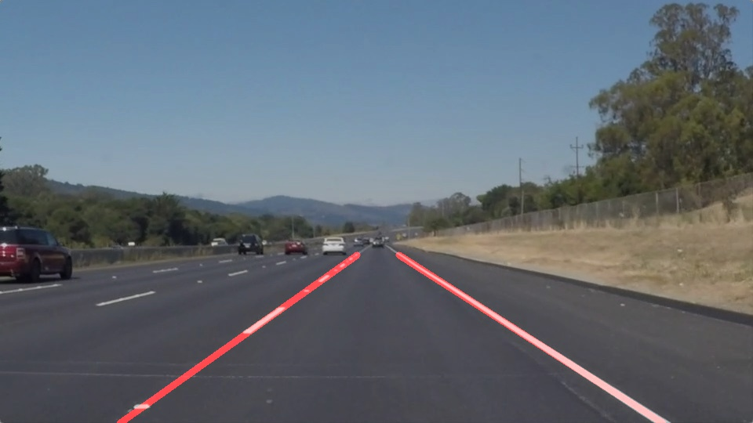
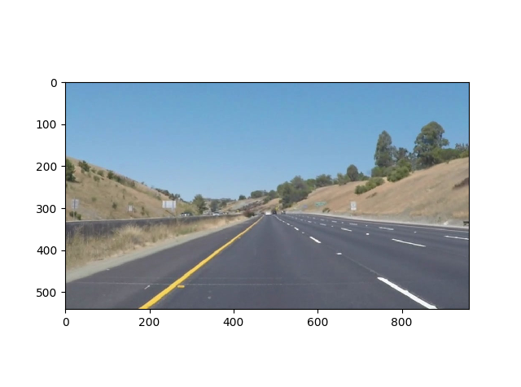
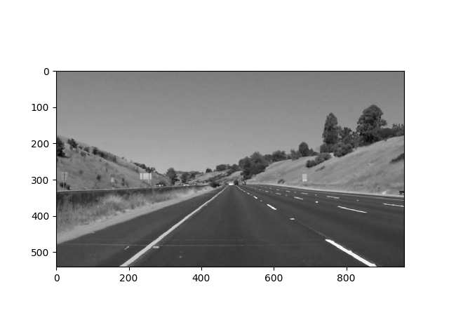
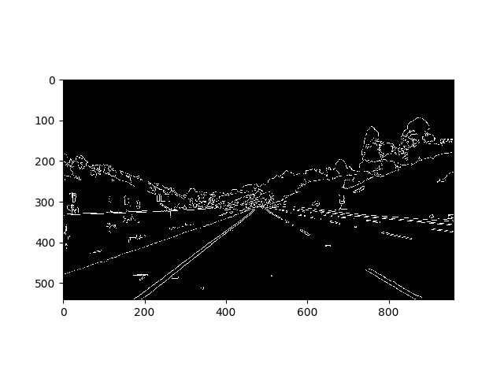
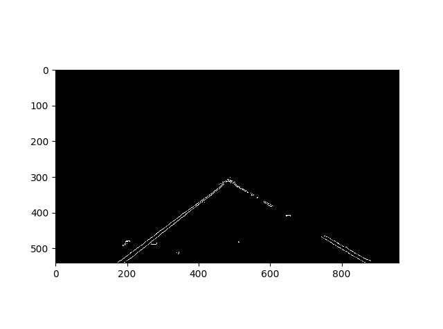
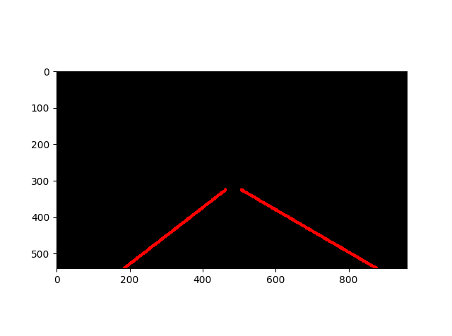
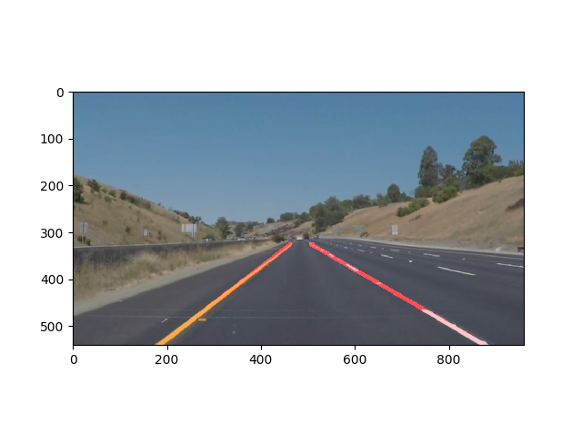
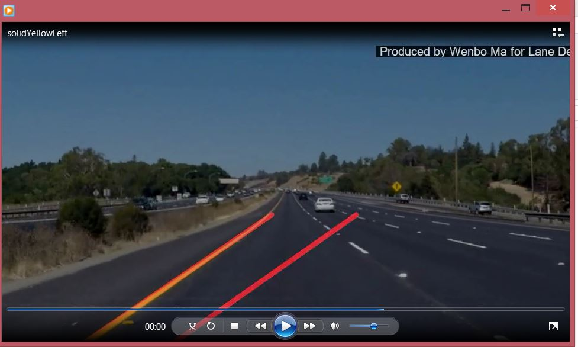

# **Finding Lane Lines on the Road** 

## Project Overview

This is the first project in the Computer Vision section of Udacity's Self-Driving Car Engineer Course. In this project, I leverage several computer
vision techniques to detect the traffic lane lines given input images. The specific tasks are:

* Build a pipeline in Python to detect lane lines in images.
* Leverage the pipeline to detect lane lines in videos

The sample input image is:

The sample output image is:

## Project Details

### 1. Pipeline to Detect Traffic Lane Lines

Input image

My pipeline consists of 5 steps. 

* Convert RGB image to grayscale 

* Detect edges in images by Canny edge detector

* Remove edges out of defined interest of areas

* Apply Hough transformation to detect lines in images (output endpoints of detected lines)

* Apply weighted regression to fit left and right lane lines

Output image by merging input image and detected lanes.

### 2. Key Design and Implementation in the Pipeline

Among the 5 major steps in the pipelines above, the first 4 steps are standard with a little effort on parameters tuning. The key in the pipeline is the 5th step where I have to detect a single left and right lanes among all the lanes found from Hough transformation.

In order to do so, I design and implement the following steps in the draw_lines() function

* Assign lines and their associated points (results from Hough transformation) to left-lane set or right-lane set. If a line has a negative slope, it will be assigned to left-lane set. Otherwise it would be assign to right-lane set.
* Fit a weighted regression line for points in left-lane set and points in right-lane set respectively.
* The reason I use weighted regression here is because ordinary regression is not robust in a sense that the detected lane can be wrong due to some "noisy" lines from Hough transformation. And I find weighted regression can solve this problem by assigning heavy weights to points on the bottom left (left-lane) or bottom right (right-lane).

  

* The weights in regression is determined by the point's x coordinate. A point in left-lane set has a larger weight if its x value is small. A point in right-lane set has a larger weight if its x value is large. The idea is giving more weights for points 

### 3. Processing Videos/Clips

As in the real-world application (self-driving car on road) the pipiline has to be able to detect lanes in real time, I also experiment the pipeline on several short clips. As videos are nothing but sequence of images, I just need to embed pipeline above into each frame in a video. Here I attach a sample video and its output video for demonstration.

Input Video

Output Video

## Potential shortcomings with your current pipeline

One potential shortcoming would be what would happen when ... 

Another shortcoming could be ...

## 3. Suggest possible improvements to your pipeline

A possible improvement would be to ...

Another potential improvement could be to ...
