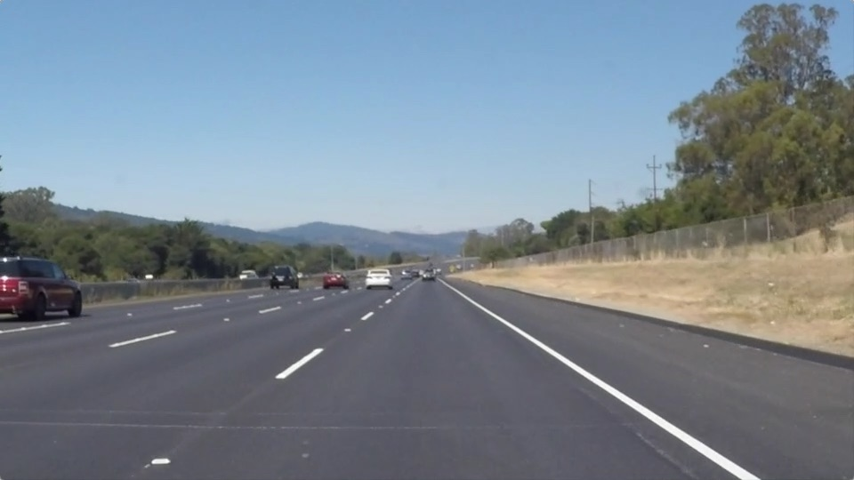

# **Finding Lane Lines on the Road** 

## Project Overview

This is the first project in the Computer Vision section of Udacity's Self-Driving Car Engineer Course. In this project, I leverage several computer
vision techniques to detect the traffic lane lines given input images. The specific tasks are:

* Build a pipeline in Python to detect lane lines in images.
* Leverage the pipeline to detect lane lines in videos

The sample input image is:

The sample output image is:

### Reflection

### 1. Describe your pipeline. As part of the description, explain how you modified the draw_lines() function.

My pipeline consisted of 5 steps. 

First, I converted the images to grayscale, then I .... 

In order to draw a single line on the left and right lanes, I modified the draw_lines() function by ...

If you'd like to include images to show how the pipeline works, here is how to include an image: 

### 2. Identify potential shortcomings with your current pipeline

One potential shortcoming would be what would happen when ... 

Another shortcoming could be ...

### 3. Suggest possible improvements to your pipeline

A possible improvement would be to ...

Another potential improvement could be to ...
